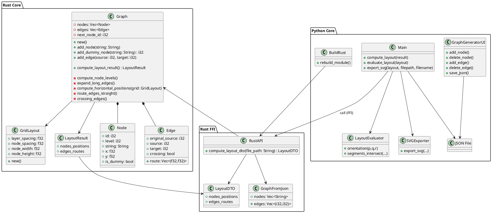

# Pipeline Layout

Projet de génération et de visualisation de pipelines sous forme de graphes orientés acycliques (**DAG**).

Ce projet combine plusieurs technologies pour gérer à la fois la logique, les performances et le rendu graphique :

- **Python** : interface utilisateur & orchestration  
- **Rust** : calcul du layout (performance)  
- **SVG généré manuellement** : rendu graphique (sans Graphviz)

---

## Structure du projet

```
projet/
│
├── consignes/                # Consignes du projet
├── notes/                    # notes du projet
├── src/
│   └── pipeline_layout/
│       ├── python_core/      # Code principal Python
│       │   ├── graphs/       # Fichiers JSON (inputs)
│       │   ├── results/      # Fichiers SVG (outputs)
│       │   ├── main.py
│       │   ├── graph_generator.py
│       │   └── build_rust.py
│       │
│       ├── rust_core/        # Code Rust
│       │   └── src/
│       │
│       ├── .venv/
│
└── README.md
```

---

## Installation

  À exécuter depuis la racine du projet

```bash
cd src/pipeline_layout

py -m venv .venv

cd .venv/Scripts
activate

pip install maturin customtkinter

cd ../..
cd python_core

python build_rust.py
```

---

## Utilisation

### Lancer le programme

```bash
python main.py
```

### Aide

```bash
python main.py -h
```

### Options disponibles

- `--path` : dossier de sortie (par défaut `results/`)
- `--name` : nom du fichier SVG
- `--file` : fichier JSON en entrée
- `--evaluate` : calcule un score du layout

---

## Création de graphes (UI)

```bash
python graph_generator.py
```

### Fonctionnement

- Ajouter un nœud → bouton ajouter nœud  
- Supprimer un nœud → sélectionner (bleu) + supprimer  
- Ajouter un lien → sélectionner 2 nœuds + ajouter lien  
- Supprimer un lien → même logique  

### Export

- Cliquer sur "générer JSON"
- Export dans `graphs/`

(le nom du fichier est automatique -> custom_graph.json)

---

## Exécution avec un fichier

```bash
python main.py --file graphs/graph.json --name graph
```

---

## Jeux de tests (déjà à disposition)

`src/pipeline_layout/python_core/graphs/`

- very_simple_graph
- ...
- dropping_node_graph

---

## Entrées / Sorties

- Entrées : JSON (`graphs/`)
- Sorties : SVG (`results/`)

---

## Choix techniques

- Pas de Graphviz
- Layout manuel :
  - placement des nœuds
  - routing des edges
  - génération SVG

Objectif : comprendre les algorithmes de layout de graphes

---

## Notes

- consignes/ contient les instructions
- notes/ toutes mes notes personnel

---

## PlantUML

